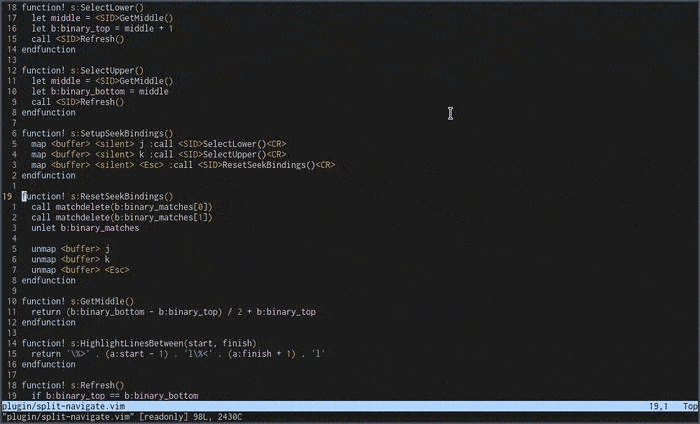

# Split Navigate

An experimental Vim plugin for navigating to lines visible on screen.

The idea is that you often see which line you want to go to, but you then need
to read the number of that line (whether absolute or relative), move your fingers
off of the home row to reach the numbers, key them in, and hit `g` or `j/k` to
move the cursor there.  While this is pretty fast, I couldn't hit but wonder
if there were a faster way.

I thought that maybe a navigation plugin based on binary search could be really
fast once you got used to it.  First of all, here's what it looks like:



# Installation

To install the plugin, you just need to copy `plugin/split-navigate.vim` to your
Vim's runtime path, whether directly or using your preferred package manager.

# Usage

To use this plugin, hit `Space` in normal mode.  This will highlight the screen
in two halves - blue for the top, red for the bottom.  If the line you want
to go to is in the top (blue) section, hit `k`; otherwise, hit `j`.  This will
refine your search area to that half; the top half of the half you selected will
now be blue, and the bottom half of the half you selected will now be red.  Continue
pressing `j`/`k` until you're reached the line you want.

You can press `Escape` at any time to cancel split navigation.

# Custom Highlight Colors

These are the default colors used:
```vimL
"default white on blue
highlight default TopHighlight term=bold ctermfg=252 ctermbg=18 guifg=fg guibg=#000080
" default yellow on red
highlight default BottomHighlight term=standout ctermfg=186 ctermbg=88 guifg=#d0d090 guibg=#800000
```

Use the following color groups to set custom colors:
```vimL
" custom blue on white (terminal only)
highlight TopHighlight term=bold ctermfg=18 ctermbg=252
" custom red on white (terminal only)
highlight BottomHighlight term=bold ctermfg=88 ctermbg=252
```

# Caveats

Here are some of the compromises I made while writing this plugin; I will address
them in the future if it takes off.

  - This plugin doesn't currently play well with folds.  It *can*, but it would take some effort and I want to make sure it's useful before I add that.
  - The keybindings (Space, j, k) are hardcoded.  I tend to dislike it when plugins choose keybindings for me, but this will at least allow users to quickly and easily try the plugin.
